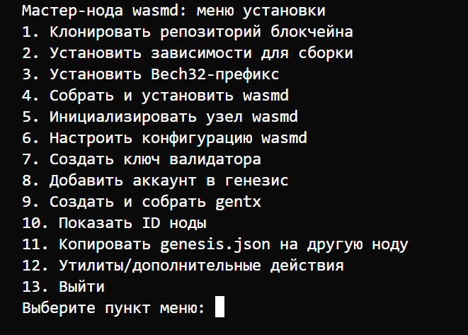

# WASMD Blockchain Network Setup



## Оглавление

1. [Введение](#введение)
2. [Требования](#требования)
3. [Быстрый старт](#быстрый-старт)
4. [Установка мастер-ноды (Master Node)](#установка-мастер-ноды-master-node)
5. [Установка валидатора (Validator Node)](#установка-валидатора-validator-node)
6. [Объединение и запуск сети](#объединение-и-запуск-сети)
7. [Меню скрипта](#меню-скрипта)
8. [Параметры .env.example](#параметры-envexample)
9. [Полезные команды](#полезные-команды)
10. [Контакты и поддержка](#контакты-и-поддержка)

---

## Введение

Этот репозиторий содержит автоматизированный скрипт для установки и настройки мастер-ноды и валидаторов блокчейна **wasmd**. Все параметры конфигурации выносены в файл `.env`, что обеспечивает гибкость и повторяемость развертывания.

## Требования

- Ubuntu 20.04/22.04 (или совместимая Linux-система)
- Права sudo
- Открытые необходимые порты (P2P, RPC, API, gRPC)
- Доступ к интернету

## Быстрый старт

1. Скопируйте `.env.example` в `.env` и отредактируйте параметры под свою сеть.
2. Запустите скрипт:
   ```bash
   chmod +x wasmd-setup.sh
   ./wasmd-setup.sh
   ```
3. Следуйте пошаговому меню.

---

## Установка мастер-ноды (Master Node)

**1. Клонировать репозиторий блокчейна**  
Клонирует исходный код блокчейна wasmd:
```bash
git clone https://github.com/kitay-sudo/wasmd.git wasmd
```

**2. Установить зависимости для сборки**  
Устанавливает все необходимые пакеты и инструменты (Go, make, git, jq и др.) для сборки и работы wasmd.

**3. Установить Bech32-префикс**  
Позволяет задать уникальный Bech32-префикс для адресов вашей сети, изменяя Makefile. Это важно для идентификации адресов в вашей сети.

**4. Собрать и установить wasmd**  
Выполняет сборку исходного кода и установку бинарного файла wasmd:
```bash
cd wasmd
make install
```

**5. Инициализировать узел wasmd**  
Создаёт стандартные конфигурационные файлы, генерирует идентификатор ноды (Node ID) и необходимые ключи.

**6. Настроить конфигурацию wasmd**  
Вносит параметры из файла `.env` в конфигурационные файлы блокчейна. Все параметры подробно описаны в `.env.example`.

**7. Создать ключ валидатора**  
Создаёт кошелёк для валидатора мастер-ноды, генерирует адрес и ключ. Имя ключа вы задаёте вручную.

**8. Добавить аккаунт в генезис**  
Добавляет указанный аккаунт с заданным балансом в файл genesis.json. Необходим для распределения токенов при запуске сети.

**9. Создать и собрать gentx**  
Создаёт специальную транзакцию (gentx) для валидатора и собирает все gentx в genesis-файл.  
Это необходимо для запуска сети с несколькими валидаторами.

---

## Установка валидатора (Validator Node)

**1-7.** Повторите шаги 1-7, как для мастер-ноды (создание кошелька валидатора включительно).

**8. Показать ID ноды**  
Позволяет получить уникальный идентификатор вашей ноды для дальнейшей настройки сети.

---

## Объединение и запуск сети

1. **Копировать genesis.json на другие ноды**  
Передайте файл genesis.json с мастер-ноды на все валидаторские ноды (по IP).

2. **Получить все Node ID**  
На каждой ноде выполните пункт "Показать ID ноды" и соберите их.

3. **Создать persistent_peers строку**  
На мастер-ноде используйте меню "Создать persistent_peers строку", чтобы сгенерировать строку для секции persistent_peers в config.toml.  
Добавьте эту строку на всех нодах.

4. **Отправить монеты валидаторам**  
С помощью меню "Отправить монеты (tx bank send)" переведите нужное количество токенов на адреса всех валидаторов.

5. **Создать валидатора через файл (validator.json)**  
Создайте валидатора на каждой ноде, используя подготовленный файл.

6. **Создать systemd-сервис и добавить в автозагрузку**  
На всех нодах создайте сервис для автоматического запуска wasmd.

7. **Тестовый запуск**  
Проверьте работу ноды командой:
```bash
wasmd start
```

8. **Продакшен запуск**  
Запустите сервис через systemd:
```bash
sudo systemctl start wasmd
sudo systemctl status wasmd
```

---

## Меню скрипта

### Мастер-нода

- Клонировать репозиторий блокчейна
- Установить зависимости для сборки
- Установить Bech32-префикс
- Собрать и установить wasmd
- Инициализировать узел wasmd
- Настроить конфигурацию wasmd
- Создать ключ валидатора
- Добавить аккаунт в генезис
- Создать и собрать gentx
- Показать ID ноды
- Копировать genesis.json на другие ноды
- Утилиты и дополнительные действия

### Валидатор

- Клонировать репозиторий блокчейна
- Установить зависимости для сборки
- Установить Bech32-префикс
- Собрать и установить wasmd
- Инициализировать узел wasmd
- Настроить конфигурацию wasmd
- Создать persistent_peers строку
- Копировать genesis.json с мастер-ноды
- Создать кошелёк
- Отправить монеты
- Создать валидатора через файл
- Показать ID ноды
- Создать systemd-сервис
- Запустить wasmd через systemd
- Тестовый запуск
- Утилиты и дополнительные действия

---

## Параметры .env.example

```ini
# Основные параметры сети
STAKE=ufzp                # Дефолтная единица стейкинга (деноминация)
CHAIN_ID=fzp-chain        # Идентификатор сети
MONIKER=master-node       # Имя вашей ноды
EXTERNAL_ADDR=1.2.3.4     # Внешний IP-адрес вашей ноды
TOKEN_DENOM=ufzp          # Дефолтная деноминация токена

# Параметры валидатора
MIN_SELF_DELEGATION=1     # Минимальная сумма делегирования для валидатора
COMMISSION_RATE=0.10      # Комиссия валидатора
COMMISSION_MAX_RATE=0.20  # Максимальная комиссия
COMMISSION_MAX_CHANGE_RATE=0.01 # Максимальное изменение комиссии

# Порты
P2P_PORT=26656            # P2P порт
RPC_PORT=26657            # RPC порт
API_PORT=1317             # API порт
GRPC_PORT=9090            # gRPC порт

# Параметры governance и экономики
MIN_DEPOSIT_AMOUNT=10000000   # Минимальный депозит для предложения
EXPEDITED_MIN_DEPOSIT_AMOUNT=50000000 # Для ускоренных предложений
CONSTANT_FEE_AMOUNT=1000      # Постоянная комиссия
MAX_VALIDATORS=100            # Максимум валидаторов
UNBONDING_TIME=1814400s       # Время анбонда
INFLATION=0.07                # Начальная инфляция
ANNUAL_PROVISIONS=1000000000  # Годовые провизии
INFLATION_RATE_CHANGE=0.13    # Изменение инфляции
INFLATION_MAX=0.20            # Макс. инфляция
INFLATION_MIN=0.07            # Мин. инфляция
GOAL_BONDED=0.67              # Целевой процент стейкинга
BLOCKS_PER_YEAR=6311520       # Блоков в год
COMMUNITY_TAX=0.02            # Комьюнити-такс
BASE_PROPOSER_REWARD=0.01     # Базовая награда пропозеру
BONUS_PROPOSER_REWARD=0.04    # Бонусная награда пропозеру
WITHDRAW_ADDR_ENABLED=true    # Включить вывод адреса

# Параметры слэшинга и безопасности
SLASH_FRACTION_DOUBLE_SIGN="0.05" # Слэш за двойную подпись
SLASH_FRACTION_DOWNTIME="0.01"    # Слэш за даунтайм
DOWNTIME_JAIL_DURATION="600s"     # Время в jail за даунтайм
SIGNED_BLOCKS_WINDOW="100"        # Окно для подписанных блоков
MIN_SIGNED_PER_WINDOW="0.05"      # Мин. процент подписанных блоков

# Прочее
MINIMUM_GAS_PRICE=0.025             # Минимальная цена газа
SEND_AMOUNT=100000000               # Сумма для отправки монет
GENTX_AMOUNT=1000000                # Сумма для gentx
```

---

## Полезные команды

- Проверить статус сервиса:
  ```bash
  sudo systemctl status wasmd
  ```
- Просмотреть логи:
  ```bash
  journalctl -u wasmd -f
  ```
- Проверить ID ноды:
  ```bash
  wasmd tendermint show-node-id
  ```

---

## Контакты и поддержка

- [Официальный репозиторий wasmd](https://github.com/CosmWasm/wasmd)
- [Документация Cosmos SDK](https://docs.cosmos.network/)
- Вопросы и помощь: откройте issue или обратитесь к администратору сети.

---

> **Внимание:** Не публикуйте приватные ключи и seed-фразы! Все параметры в `.env.example` — публичные и не содержат приватных данных.
